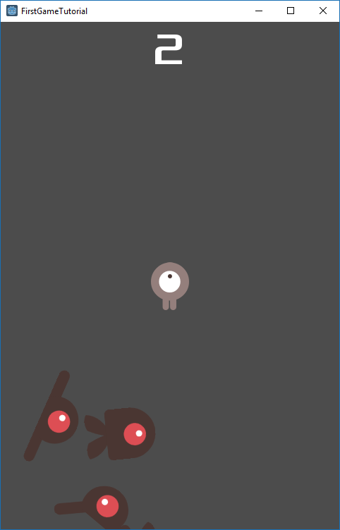

# Info

This is the csharp example of the [your first game](http://docs.godotengine.org/en/3.0/getting_started/step_by_step/your_first_game.html) tutorial for godot 3. If you get stuck use this as a reference, although not complete this is a rough example of the working game at work.

# Here's a screenshot

